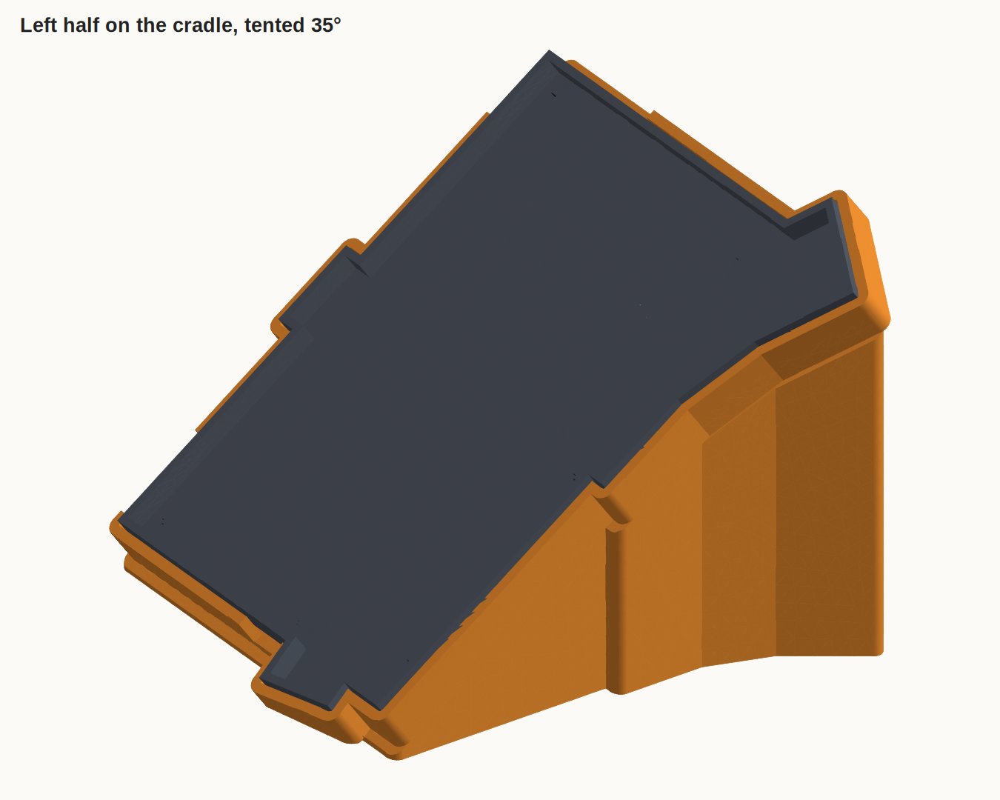
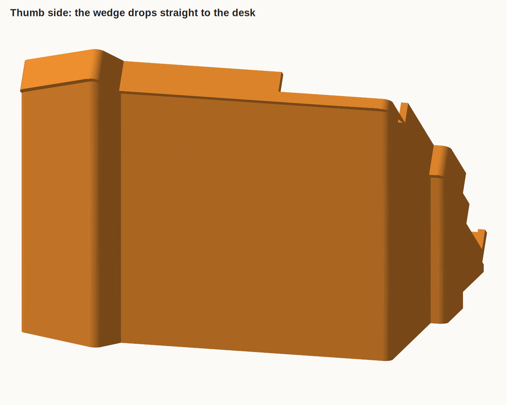
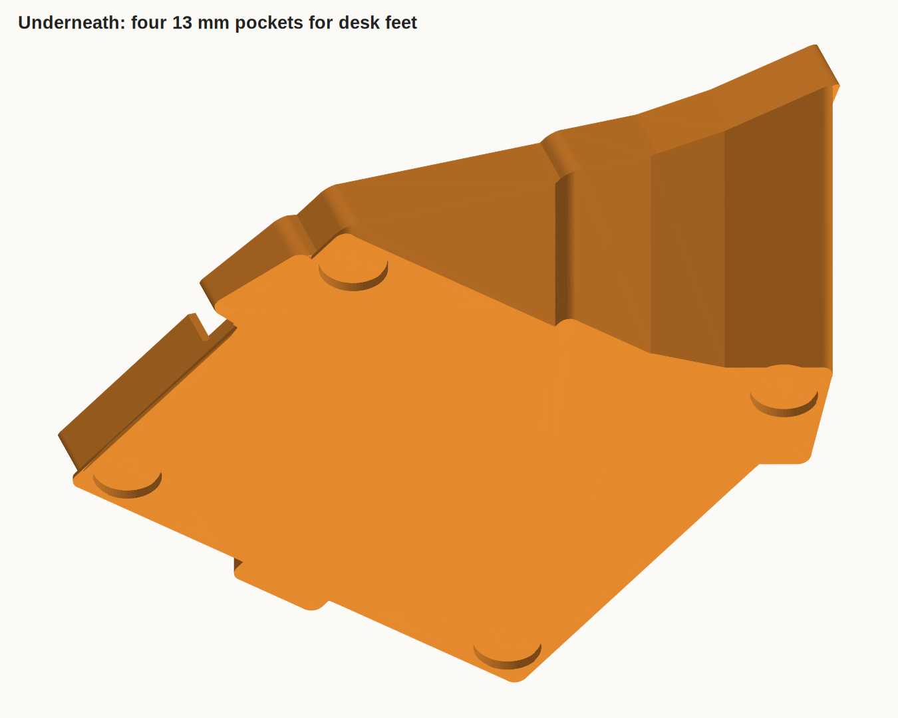

# Tenting cradle

A stand that tents one half of a TOTEMX split keyboard to 35°. The keyboard's bottom plate drops into a pocket on top of a solid PLA wedge, and the wedge sits on four stick-on rubber feet. One part per half, no supports. It lives in this repo for the slicer profile and the reel's renderer, and shares no other code.

```
uv run tenting build     # tenting/stl/: cradle_left, cradle_right, test_fit_left, test_fit_right
uv run tenting render    # tenting/png/
uv run tenting slice     # tenting/gcode/, needs prusa-slicer on the path
uv run pytest tests/test_tenting.py
```

Every dimension is in `tenting/spec.py`. The parts are built in `tenting/parts.py`.



## Shape

The plate tilts about a front-to-back line under its outermost pinky point, the corner of the tab beside the bottom pinky key. The thumb side rises. Under that corner the pocket floor is 0.6 mm thick, three layers, so the board sits no higher than it has to. From there the wedge drops straight down to the desk, so its footprint is no bigger than the tilted plate's. It stands 87 mm tall at the thumb side and takes 123 × 115 mm of bed.

The pocket is the plate's outline plus 0.5 mm all round. The keyboard's own 1 mm rubber feet stand on the pocket floor, and a 2 mm lip rises 5 mm above the plate's bottom face. Three notches cut the lip to the floor, placed from the TOTEMX PCB and checked against the openings in the case's walls:

- the XIAO's USB-C, on the top edge at the pinky end
- the TRRS jack and the second USB-C, which sit either side of the top inner corner, so one cut takes both
- the power switch, on the pinky edge

The four pockets underneath are 13 mm across and 2 mm deep, at the corners of the base. The two on the pinky side sit 16 mm in from the low edge, the closest point where the wedge is thick enough to hold one.

 

## Which bottom plate

`OUTLINE` in `spec.py` is the 139.3 × 109.9 mm bottom plate: the low-profile case's, which has the same outline as `Case/20250215.TOTEMX.BOTTOMPLATE.00.stl`. Both are in [azhizhinov/TOTEMX](https://github.com/azhizhinov/TOTEMX) under CERN-OHL-P. The 20250211 and 20250806 cases have a 142.7 × 112.9 mm bottom tray instead, 3 mm bigger all round the main body and the same at the thumb cluster. A pocket cut for one is 3 mm loose or won't fit on the other, so measure your plate before you print.

## Printing

Every part slices with the domino profile, `slicer/profile.ini`, and no changes. CI uploads the gcode as `tenting-<part>.gcode`.

| Part | Time | PLA |
| --- | --- | --- |
| cradle_left, cradle_right | 9h 20m each | 117 g each |
| test_fit_left, test_fit_right | 1h 40m each | 16 g each |

Print a test-fit tray first. It is the cradle's pocket, lip and notches on a flat 0.6 mm floor. The first one, sized for the bigger tray, fit the thumb cluster and was 3 mm loose everywhere else, which is how the outline above got settled. The second fit, and so did the cradle printed from it.
